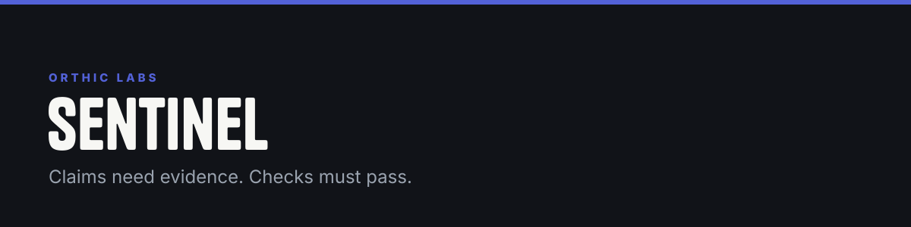
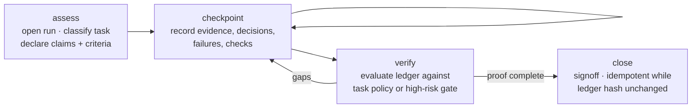
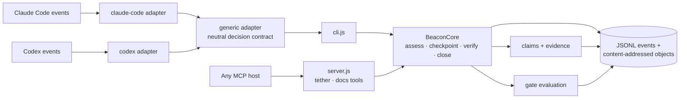

**Coding agents can sound certain after reading stale code, guessing an API, or skipping a failed test. Sentinel is the local ledger that makes certainty cost evidence: material claims need source-backed proof, and required checks must pass before work is allowed to close.**

<sub>Public name **Sentinel**. The CLI, env vars, and MCP tool keep the compatibility alias <code>tether</code>.</sub>


## The problem it removes

An agent that "verified" something by asserting it has verified nothing. Sentinel splits the difference between *stated* and *proven* into data:

- A repository claim counts only when Sentinel itself reads the file and hashes its content. A model-supplied excerpt is stored for context, but it never satisfies repository-evidence policy on its own.
- A check counts only when its `executor` is not `model_claim`. Executable checks outrank self-reported confidence, always.
- Uncertainty is typed, not stylistic: every claim is `open`, `supported`, `refuted`, `stale`, or `waived` — and a material claim left `open` blocks signoff.

The result is a proof trail — claim, source hash, check result, and the policy that allowed signoff — instead of a paragraph that sounds confident.

## A run, end to end



Four operations, one core. Responses return bounded state diffs — claim updates, next actions, unresolved items — never a replay of full history into model context.

## What counts as proof

Evidence carries a trust class, ranked. Higher classes beat lower ones; the bottom rung never satisfies policy alone.

| Rank | Trust class |
|---|---|
| 1 | Deterministic execution (tests, builds, typed commands) |
| 2 | Live local state (files Sentinel read and hashed itself) |
| 3 | Installed dependency source |
| 4 | Official versioned documentation |
| 5 | Primary current source |
| 6 | Independent verifier |
| 7 | Model assertion — context only, never sufficient |

Minimum proof scales with the work:

| Task kind | To close, you need |
|---|---|
| docs | trusted docs/log/test evidence + a passing check |
| refactor | attested repo evidence + a passing check |
| bugfix / feature | attested repo evidence + trusted docs/log/test evidence + a passing check |
| release | the same evidence classes + **two** passing checks |

High-risk actions additionally require explicit intent, a blast radius, and a safety case before the gate opens.

## Enforcement that survives model amnesia

Sentinel does not rely on the model remembering the protocol. Host adapters translate native events — tool failure, blind identical retry, risky command, signoff attempt, CI boundary — into one neutral decision contract: `allow / continue / block / noop`.



Two details do a lot of work here:

- **Retry budgets.** A failed action is fingerprinted (normalized command + error class + exit code + mutation). A blind identical retry can be blocked; a meaningfully changed attempt earns a new fingerprint.
- **Dependency-aware invalidation.** Evidence is bound to event keys — file content hash, lockfile version, worktree state, external revision, check input fingerprint. When a key changes, the linked evidence goes stale and dependent claims need rechecking. Proof does not outlive the thing it proved.

## The store

Local, durable, tamper-evident. Nothing leaves the machine.

```
~/Library/Application Support/tether/stores/<project-hash>/
├── events.jsonl                      # append-only; earlier events survive interrupts
└── objects/sha256/<prefix>/<digest>  # deduplicated, content-addressed payloads
```

Owner-only directories, `0600` files, atomic temp-file-then-rename writes. `<project-hash>` is the first 16 hex chars of the SHA-256 of the project root. Trusted-caller status comes from a `0600` host token file, not an env var.

## Quick start

```sh
npx @orthic-labs/tether

node cli.js assess --operator --json <<'JSON'
{"summary":"Fix parser","task_kind":"bugfix","claims":[{"text":"Parser rejects escaped quotes","kind":"behavioral_fact","materiality":"critical"}]}
JSON
```

MCP surface:

```
tether(operation: assess | checkpoint | verify | close)
docs(library, topic, version?, project_root?)
```

In CI, the exit code of `verify --gate signoff` is the enforcement surface. `node cli.js doctor` checks the host token, store writability, and Node ≥ 20.

The bundled `docs` tool is version-aware: it resolves the dependency version from your lockfile and searches the installed package source before any remote docs. Results are hashed, bounded, labeled untrusted, and scanned for injection-shaped content.

## What's new in 2.x

- Hooks-first enforcement with durable local state; v1 MCP surface replaced by `tether` + `docs`.
- Host token file replaces `TETHER_TRUSTED_CALLER`; store moved out of the project tree (legacy `.tether/` still read).
- Gate evaluation is rubric-driven: checks must link a criterion and match a CheckSpec; supported claims require a matching evidence class.
- MCP schema strips model-writable `trust_class` / `executor` / `status` — those fields are issuer-derived now.
- Stop-event handling distinguishes a conversational pause from completion intent; completion runs verify, then a transactional close.

## Honest limits

- It proves the supplied acceptance policy — not the absence of every possible bug.
- External facts still depend on an available authoritative source.
- Model-independent enforcement requires the host's hook adapter to be installed.
- Deprecated v1 tools return migration errors unless `TETHER_LEGACY_TOOLS=1` is set temporarily.

## Go deeper

| Doc | What's in it |
|---|---|
| [TETHER-MASTER.md](TETHER-MASTER.md) | Full adjudicated guide — 49 indexed claims |
| [docs/architecture.md](docs/architecture.md) | Components, data flow, flow-inventory status |
| [docs/integration-matrix.md](docs/integration-matrix.md) | CLI / MCP / hooks / CI surfaces |
| [docs/store-migration.md](docs/store-migration.md) | Store layout, host token, rename aliases |

---

<sub><b><a href="https://orthic-labs.github.io">Orthic Labs</a></b> — local-first infrastructure for AI-assisted development.<br>
<a href="https://github.com/Orthic-Labs/Membrane">Membrane</a> · <a href="https://github.com/Orthic-Labs/Cortex">Cortex</a> · <a href="https://github.com/Orthic-Labs/Sentinel">Sentinel</a> · <a href="https://github.com/Orthic-Labs/Roundtable">Roundtable</a> · <a href="https://github.com/Orthic-Labs/Morph">Morph</a> · <a href="https://github.com/Orthic-Labs/CutRight">CutRight</a> · <a href="https://github.com/Orthic-Labs/claudecodeX">claudecodeX</a></sub>
