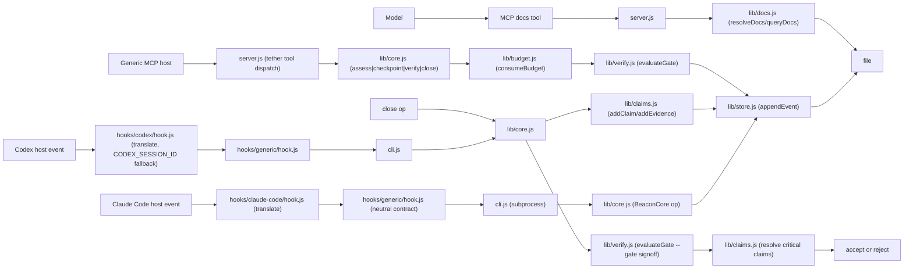

<!-- generated by blueprint 0.2.0 gen:5ddd897fa6c045402bf9ad326c4b8162 — edit code/docs sources, not this file -->

# tether — Architecture

Technical overview of components, interfaces, classified flow inventory, and capability coverage.
The deterministic Phase-1 graph supplies the evidence substrate; Phase-2 understanding supplies
the human component names and operational flow. Raw file and symbol nodes are intentionally omitted.

Tether is a local-first enforcement ledger for AI coding agents. It ships as one npm package (`@orthic-labs/tether`) with two runtime entry points: a CLI transport (`cli.js`) and a generic-host MCP stdio server (`server.js`) that exposes `tether` and `docs` tools. The four-op surface (`assess`/`checkpoint`/`verify`/`close`) is implemented as a single `BeaconCore` (alias `ReflectCore`) class living in `lib/core.js`, with typed claims/evidence (`lib/claims.js`), durable JSONL store (`lib/store.js`), per-op budgets (`lib/budget.js`), and gate evaluation (`lib/verify.js`). Three host adapters translate their native hook events into a neutral JSON decision: `hooks/codex/hook.js` (Codex), `hooks/claude-code/hook.js` (Claude Code), and `hooks/generic/hook.js` (any MCP host). Trust is gated through a host token file (`<host-data>/host.token`) rather than env-vars, and `lib/host.js` resolves the data dir under dual `beacon`/`tether` aliases during the in-progress rename. Architecturally the repo is a single deployable unit (one bin, one server) with three layered responsibilities: hooks-first enforcement, durable evidence ledger, and exact-version docs retrieval. The current in-tree state has durable persistence and typed claims already wired (`CHANGELOG.md:23-26`, `lib/store.js`, `lib/claims.js`); the `codex` and `claude-code` adapters are present but `hooks/codex/hooks.json` and `hooks/claude-code/settings.json` are the only shipside integration surfaces for those hosts. A planned `docs/store-migration.md` rename reserves dual aliases (`beacon`/`tether`, `BEACON_*`/`TETHER_*`) until the cutover completes; treat that as an intentional migration state, not drift.

## System workflow

_(source: .agent/understanding.json:architecture.dataFlow)_

## Components

- **CLI transport** — Primary transport for hooks and automation; routes subcommands (`assess`/`checkpoint`/`verify`/`close`/`init`/`show`) to BeaconCore or the MCP server entry _(source: Undetermined — no evidence recorded)_
- **Generic MCP server** — stdio MCP server exposing `tether` and `docs` tools; the four-op surface plus docs resolver _(source: Undetermined — no evidence recorded)_
- **BeaconCore (ReflectCore alias)** — Single core class that owns the four-op lifecycle (assess/checkpoint/verify/close), policy gates, and decision emission _(source: Undetermined — no evidence recorded)_
- **Claims ledger** — Typed claim + evidence model with hashes, invalidation keys, and trust class routing _(source: Undetermined — no evidence recorded)_
- **Durable store** — Append-only JSONL event log + content-addressed object dir, atomic write-rename, owner-only perms _(source: Undetermined — no evidence recorded)_
- **Per-op budgets** — Caps reflection-visible ops: ops per run, retries per fingerprint, external requests, verifier runs _(source: Undetermined — no evidence recorded)_
- **Verify / gate evaluation** — Rubric-driven gate; matches CheckSpec to criteria; evaluates policy minima (signoff / signoff-risk) _(source: Undetermined — no evidence recorded)_
- **Docs resolver** — Exact-version installed-source lookup for npm/pnpm/yarn and Cargo; progressive retrieval with continuationToken; cache TTL _(source: Undetermined — no evidence recorded)_
- **Host data dir resolver** — Resolves host data dir (`~/Library/Application Support/beacon/` etc) under dual `beacon`/`tether` aliases; reads/writes `host.token` (0600) _(source: Undetermined — no evidence recorded)_
- **Generic hook adapter** — Neutral JSON-in / decision-out contract shared by every host; never executes user commands; calls local CLI for high-risk / signoff gates _(source: Undetermined — no evidence recorded)_
- **Codex hook adapter** — Translates Codex native hook events into the neutral JSON shape; uses CODEX_SESSION_ID fallback; reads CODEX_PLUGIN_ROOT _(source: Undetermined — no evidence recorded)_
- **Claude Code hook adapter** — Translates Claude Code native hook events; honors stop_hook_active to prevent loops _(source: Undetermined — no evidence recorded)_
- **Shared hook adapter** — Shared transport glue between the generic hook entry and the host CLI invocation; enforces allow/continue/block/noop contract _(source: Undetermined — no evidence recorded)_
- **Codex plugin manifest** — Installs Codex lifecycle hooks at install time; declares hook points the Codex CLI loads _(source: Undetermined — no evidence recorded)_

## Flow inventory

| Flow | Status | Evidence | Impact |
|---|---|---|---|
| Hook event -> decision | covered | hooks/claude-code/hook.js -> hooks/generic/hook.js -> cli.js -> lib/core.js (CHANGELOG.md P1 P2, hooks/generic/README.md:3-7) | primary enforcement surface; on missing adapter, host integration degrades to the generic MCP server path |
| assess / checkpoint / verify / close lifecycle | covered | lib/core.js (BeaconCore); server.js tool dispatch; cli.js subcommands; README.md:11-37; test/v2.mjs (e2e lifecycle per CHANGELOG.md) | core product loop |
| Docs retrieval (exact-version installed source) | covered | lib/docs.js; TETHER-MASTER.md §4.7 (Ecosystem adapters: npm/pnpm/yarn, Cargo first; Python/Go secondary). continuationToken, TTL cache, char/byte caps, lossless splitting per TETHER-MASTER.md:94. | unique feature vs Context7 |
| Durable persistence (JSONL + content-addressed objects) | covered | lib/store.js; CHANGELOG.md P1 (durable tables fsync immediately); TETHER-MASTER.md:259 (F1 IMPLEMENT) | survives process restart; host can reboot without losing run state |
| SSRF / hostile-content hardening for general docs fetch | partial | TETHER-MASTER.md:293 (H2 PARTIAL -> IMPLEMENT). v1.1 had HTTPS enforcement, redirect refusal, byte caps for its single upstream. Full allowlist + DNS/private-IP/MIME controls only land when general official-docs fetching ships (E3 chain). | external-fetch attack surface is reduced but not fully closed |
| Multi-agent reflexion fallback | covered | TETHER-MASTER.md:340 (K6 - host-side orchestration; the ledger supports it via escalation decision + shared run refs without owning it) | intentionally delegated to host |
| Memory taxonomy engine with decay | partial | TETHER-MASTER.md:266 (F8 PARTIAL). Adopt typing on memory candidates; reject a Reflect-owned long-term memory engine with decay (workspace already has MemRight). | memory typing ships; decay engine does not (intentional) |
| Dependency cascade (stale claim -> needs_review decisions -> invalidated signoff checks) | partial | TETHER-MASTER.md:219,548; claim.tether-master-md.cd7a.219 status: stale | stale-evidence cascade documented but not fully wired |
| Escalation decision reasons enum | planned | TETHER-MASTER.md:282 (G7 PLANNED); claim.tether-master-md.cd7a.282 status: planned | host cannot yet surface a structured escalation reason |

## Capability coverage

| Capability | Status | Evidence | Provider |
|---|---|---|---|
| document/ADR/plan | covered | TETHER-MASTER.md (full adjudication, 49 claims indexed), README.md, docs/baseline.md, docs/blueprint-orientation.md, docs/integration-matrix.md, docs/store-migration.md, CHANGELOG.md | blueprint-treesitter + repo author |
| code symbols | covered | 36 files tracked in .blueprint/manifest.json; code symbols referenced by claims (lib/store.js, lib/claims.js, lib/budget.js, lib/verify.js, lib/core.js, lib/docs.js, lib/host.js, cli.js, server.js, hooks/*) | blueprint-treesitter (LEXICAL precision) |
| code relationships | partial | Edges in .blueprint/manifest.json are mostly doc->claim or doc->code_ref. No supportedEdgeTypes declared (manifest.json:40). Call-graph edge detection is partial. | blueprint-treesitter (CROSS_FILE_HEURISTIC max) |
| task retrieval | covered | .agent/queue.json (full task queue), .agent/index.json (anchors list of 15 code files), .agent/map.json (36 tracked files) | blueprint-static |
| contradiction arbitration | covered | .agent/claims.json with status field (implemented / partial / planned / stale / claim); TETHER-MASTER.md §3 master adjudication table per agent claim | blueprint-static + repo author |

## Health & Security (loud-partial when graph is missing)

- Stale claims: **10** _(source: .agent/stale.json:staleClaims)_
- Missing references: **3** _(source: .agent/stale.json:missingReferences)_
- Detailed health and security findings live in `.agent/understanding.json`; every synthesized
  component and flow above retains its recorded evidence. _(source: .agent/understanding.json)_

## Status

Generated from index signature `5ddd897fa6c045402bf9ad326c4b8162`. Unchanged-repo rebuilds are byte-identical.
